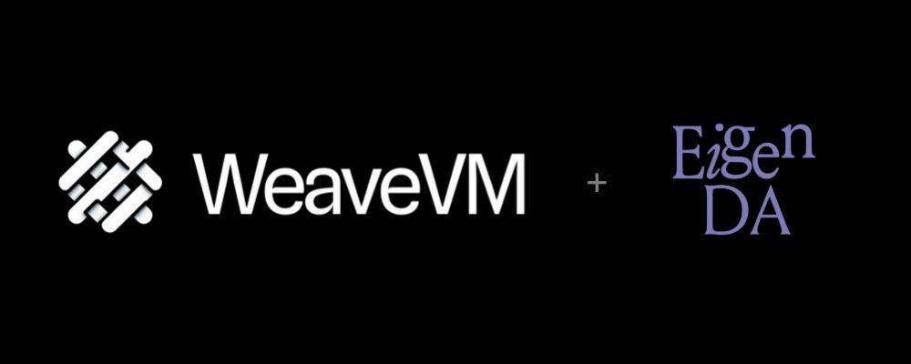
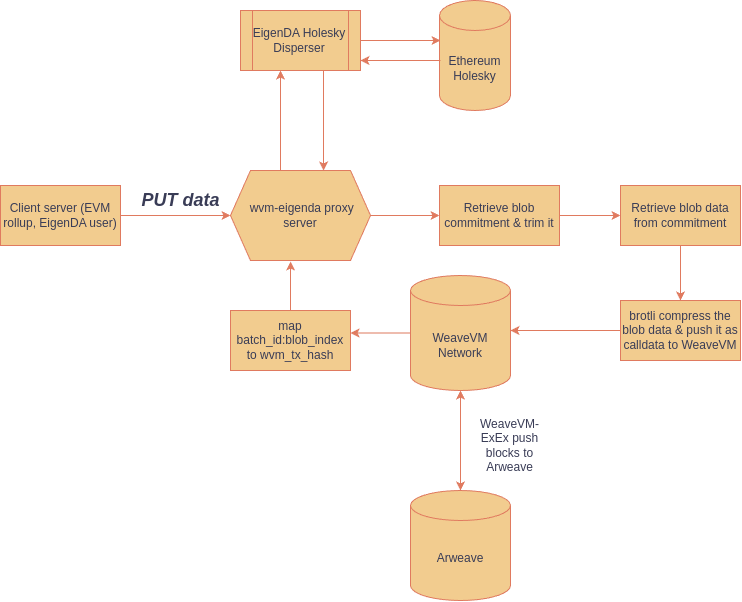

<p align="center">
  <a href="https://wvm.dev">
    
  </a>
</p>


## About EigenDA Side Server Proxy
It's a service that wraps the [high-level EigenDA client](https://github.com/Layr-Labs/eigenda/blob/master/api/clients/eigenda_client.go), exposing endpoints for interacting with the EigenDA disperser in conformance to the [OP Alt-DA server spec](https://specs.optimism.io/experimental/alt-da.html), and adding disperser verification logic. This simplifies integrating EigenDA into various rollup frameworks by minimizing the footprint of changes needed within their respective services.

## About WeaveVM-EigenDA Side Server Proxy
WeaveVM-EigenDA Sidecar Proxy is a fork of EigenDA's sidecar proxy modified to use [WeaveVM](https://wvm.dev) as a permanent archive layer for EigenDA blobs dispersed from this customized proxy server.

## How it works
On each `PUT` request it compresses the encoded eigenDA blob using brotli compression and stores the compressed blob on WeaveVM as transaction type 2 calldata.

There are endpoints to get `txhash` for a provided EigenDA commitment and to get encoded blob directly from WeaveVM.

The stage of this integration is as PoC and an experimental feature. In this first v0 iteration the proxy internally stores mapping of eigenda blob as `batch_id:blob_index -> wvm_tx_hash`

## WeaveVM Proxy Methods

### 1- Get WeaveVM tx hash of a dispersed blob

```bash
curl -X GET "https://eigenda-proxy-1047776281941.us-central1.run.app/get/0x$COMMITMENT?commitment_mode=simple" \
 -H "Content-Type: application/octet-stream"
```

### 2- Get a dispersed blob from WeaveVM

```bash
curl -X GET "https://eigenda-proxy-1047776281941.us-central1.run.app/wvm/get/0x$COMMITMENT?commitment_mode=simple" \
 -H "Content-Type: application/octet-stream"
```

## Data pipelines

### PUT blob workflow


### GET blob workflow


## Full test workflow example

- WeaveVM Alphanet block explorer: https://explorer.wvm.dev
- WeaveVM-EigenDA sidecar server proxy endpoint: https://eigenda-proxy-1047776281941.us-central1.run.app

### 1) Post data 

```bash
 curl -X POST "https://eigenda-proxy-1047776281941.us-central1.run.app/put/?commitment_mode=simple" \
      --data-binary "WeaveGM from wvm-proxy" \
      -H "Content-Type: application/octet-stream" \
      --output response.bin
```
### 2) Trim the blob commitment

```bash
COMMITMENT=$(xxd -p response.bin | tr -d '\n' | tr -d ' ')
```

### 3) Get data from the proxy

```bash
curl -X GET "https://eigenda-proxy-1047776281941.us-central1.run.app/get/0x$COMMITMENT?commitment_mode=simple" \
 -H "Content-Type: application/octet-stream"
```
### 4) Get the WeaveVM data TXID for a commitment

```bash
curl -X GET "https://eigenda-proxy-1047776281941.us-central1.run.app/wvm/get/txhash/0x$COMMITMENT?commitment_mode=simple" \
 -H "Content-Type: application/octet-stream"
```

### 5) Get the EigenDA archived blob's decoded data from WeaveVM

This method use WeaveVM's `wvm://` data retrieval gateway to retrieve the data associated with a WeaveVM transaction (calldata) natively from WeaveVM's self-DA layer and Arweave's permanent WeaveVM-ExEx data protocol. [Check out the `wvm-data-retriever` codebase here](https://github.com/weavevM/wvm-data-retriever)

```bash
curl -X GET "https://eigenda-proxy-1047776281941.us-central1.run.app/wvm/get/0x$COMMITMENT?commitment_mode=simple" \
 -H "Content-Type: application/octet-stream"
```

## License
This project is licensed under the [MIT License](./LICENSE)


