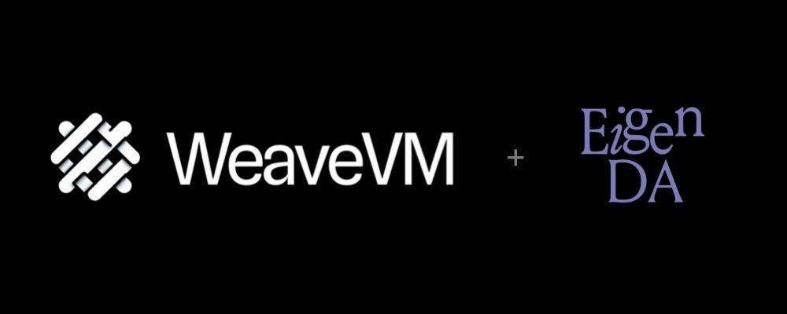
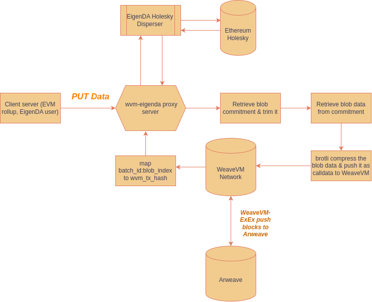
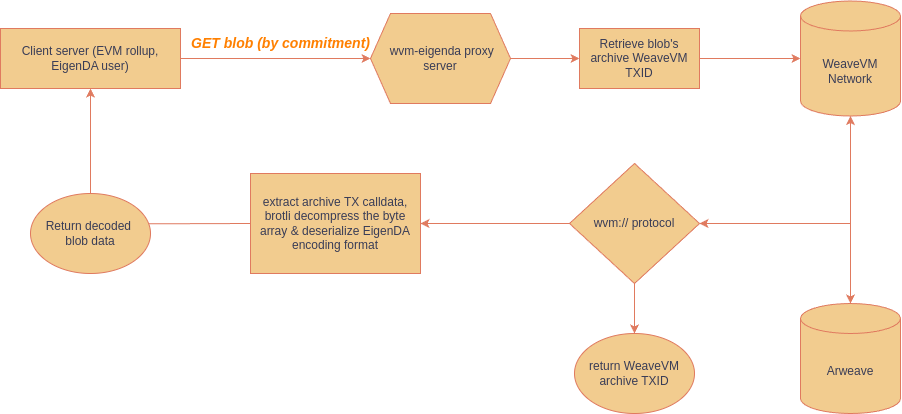

<p align="center">
  <a href="https://wvm.dev">
    
  </a>
</p>

## Synopsis

WeaveVM-EigenDA Sidecar Proxy integrates WeaveVM as a permanent storage layer for EigenDA blobs. When blobs are dispersed through a proxy server with WeaveVM storage enabled, they are automatically stored in WeaveVM's network.

## About WeaveVM

WeaveVM is a sovereign EVM network built towards the goal of solving the EVM storage dilemma with Arweave. It gives the coming generation of high-performance chains a place to settle and store onchain data, without worrying about cost, availability, or permanence.

WeaveVM offers scalable and cost-effective storage by using Arweave as a decentralized hard drive, both at the node and smart contract layer. This makes it possible to store large data sets and run web2-like applications without incurring EVM storage fees. [Check out WeaveVM docs](https://docs.wvm.dev).

## Prerequisites

Check the `.env` file for configuration settings specific to the Holesky testnet

```env
# WeaveVM secondary storage related environment variables

# Set to true to enable WeaveVM chain as a secondary storage
# EIGENDA_PROXY_WEAVE_VM_ENABLED=

# WeaveVM Alphanet RPC endpoint
# EIGENDA_PROXY_WEAVE_VM_ENDPOINT=https://testnet-rpc.wvm.dev/

# WeaveVM chain id
# EIGENDA_PROXY_WEAVE_VM_CHAIN_ID=9496

# WeaveVM web3signer endpoint
# EIGENDA_PROXY_WEAVE_VM_WEB3_SIGNER_ENDPOINT=

# WeaveVM private key in case you don't use web3signer, not recommended
# EIGENDA_PROXY_WEAVE_VM_PRIV_KEY_HEX= ""
```

## Setup Guide: Booting EigenDA proxy with WeaveVM as a secondary storage

### Option 1: with weave vm private key

```log
./bin/eigenda-proxy \
    --addr 127.0.0.1 \
    --port 3100 \
    --eigenda.disperser-rpc disperser-holesky.eigenda.xyz:443 \
    --eigenda.signer-private-key-hex $PRIVATE_KEY \
    --eigenda.eth-rpc https://ethereum-holesky-rpc.publicnode.com \
    --eigenda.svc-manager-addr 0xD4A7E1Bd8015057293f0D0A557088c286942e84b \
--wvm.endpoint https://testnet-rpc.wvm.dev/ \
--wvm.chain_id 9496 \
--storage.fallback-targets wvm \
--storage.concurrent-write-routines 2
```

you should also set `EIGENDA_PROXY_WEAVE_VM_PRIV_KEY_HEX` enviroment variable with the private key of your WeaveVM EOA.

### Option 2: with web3signer

***Disclaimer: Using a remote signer comes with risks, please read the following warnings before proceeding:***

> Remote signing is complex and risky. Remote signing is generally only desirable for enterprise users or users with unique security requirements.

> Web3Signer is not maintained by WeaveVM team. The Web3Signer tool is maintained by Consensys, the same team that maintains Teku. The WeavVM team does not maintain Web3Signer or make any guarantees about its safety or effectiveness.

- For a simple test deployment of a local Web3Signer setup, refer to: <https://github.com/allnil/web3signer_test_deploy>
- For complete documentation, consult: <https://docs.web3signer.consensys.io/>

To run EigenDA Sidecar Service Proxy with WeaveVM as secondary storage and Web3Signer:

```log
./bin/eigenda-proxy \
    --addr 127.0.0.1 \
    --port 3100 \
    --eigenda.disperser-rpc disperser-holesky.eigenda.xyz:443 \
    --eigenda.signer-private-key-hex $PRIVATE_KEY \
    --eigenda.eth-rpc https://ethereum-holesky-rpc.publicnode.com \
    --eigenda.svc-manager-addr 0xD4A7E1Bd8015057293f0D0A557088c286942e84b \
--wvm.endpoint https://testnet-rpc.wvm.dev/ \
--wvm.chain_id 9496 \
--storage.fallback-targets wvm \
--storage.concurrent-write-routines 2 \
--wvm.web3signer_endpoint http://localhost:9000
```

## How it works

On each `PUT` request, the proxy stores the encoded EigenDA blob on WeaveVM as a type 2 transaction calldata. The WeaveVM network then permanently archives this data on the Arweave protocol.

***The stage of this integration is as PoC and an experimental feature.*** In this first v0 iteration the proxy internally stores mapping of eigenda blob as `key-> wvm_tx_hash`

### Commands and example of usage

#### 1) Put

```bash
curl -X POST "http://127.0.0.1:3100/put?commitment_mode=simple" \
      --data-binary "some data that will successfully be written to EigenDA" \
      -H "Content-Type: application/octet-stream" \
      --output response.bin
```

#### 2) Get

```bash
COMMITMENT=$(xxd -p response.bin | tr -d '\n' | tr -d ' ')
curl -X GET "http:/127.0.0.1:3100/get/0x$COMMITMENT?commitment_mode=simple" \
     -H "Content-Type: application/octet-stream"
```

### example workflow log

```log
➜ ✗ curl -X POST "http://127.0.0.1:3100/put?commitment_mode=simple" \
      --data-binary "some data that will successfully be written to EigenDA" \
      -H "Content-Type: application/octet-stream" \
      --output response.bin


➜ ✗ COMMITMENT=$(xxd -p response.bin | tr -d '\n' | tr -d ' ')

➜ ✗  curl -X GET "http:/127.0.0.1:3100/get/0x$COMMITMENT?commitment_mode=simple" \
     -H "Content-Type: application/octet-stream"
some data that will successfully be written to EigenDA%
```

## Data pipelines

### PUT blob workflow



### GET blob workflow



## Full test workflow example

- `wvm-eigenda-proxy` WeaveVM archiver address: [0xF8a5a479f04d1565b925A67D088b8fC3f8f0b7eF](https://explorer.wvm.dev/address/0xF8a5a479f04d1565b925A67D088b8fC3f8f0b7eF)
- Archive pool address: [0x0000000000000000000000000000000000000000](https://explorer.wvm.dev/address/0x0000000000000000000000000000000000000000)
- EigenDA network: Holesky
- WeaveVM network: Alphanet
- WeaveVM-EigenDA sidecar server proxy endpoint: <https://eigenda-proxy-1047776281941.us-central1.run.app>

### 1) Post data

```bash
 curl -X POST "https://eigenda-proxy-1047776281941.us-central1.run.app/put/?commitment_mode=simple" \
      --data-binary "WeaveGM from wvm-proxy" \
      -H "Content-Type: application/octet-stream" \
      --output response.bin
```

### 2) Trim the blob commitment

```bash
COMMITMENT=$(xxd -p response.bin | tr -d '\n' | tr -d ' ')
```

### 3) Get data from the proxy

```bash
curl -X GET "https://eigenda-proxy-1047776281941.us-central1.run.app/get/0x$COMMITMENT?commitment_mode=simple" \
 -H "Content-Type: application/octet-stream"
```

### 4) Get the WeaveVM data TXID for a commitment

```bash
curl -X GET "https://eigenda-proxy-1047776281941.us-central1.run.app/wvm/get/txhash/0x$COMMITMENT?commitment_mode=simple" \
 -H "Content-Type: application/octet-stream"
```

### 5) Get the EigenDA archived blob's decoded data from WeaveVM

This method use WeaveVM's `wvm://` data retrieval gateway to retrieve the data associated with a WeaveVM transaction (calldata) natively from WeaveVM's self-DA layer and Arweave's permanent WeaveVM-ExEx data protocol. [Check out the `wvm-data-retriever` codebase here](https://github.com/weavevM/wvm-data-retriever)

```bash
curl -X GET "https://eigenda-proxy-1047776281941.us-central1.run.app/wvm/get/0x$COMMITMENT?commitment_mode=simple" \
 -H "Content-Type: application/octet-stream"
```

## Helpful Links

- WeaveVM Explorer: <https://explorer.wvm.dev>
- WeaveVM tWeaveVM faucet: <https://wvm.dev/faucet>
- Discord: <https://dsc.gg/wvm>
